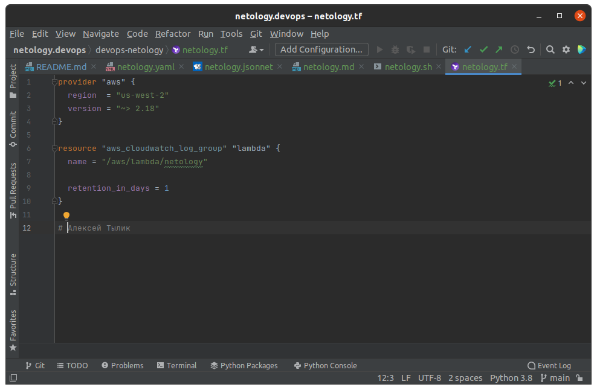
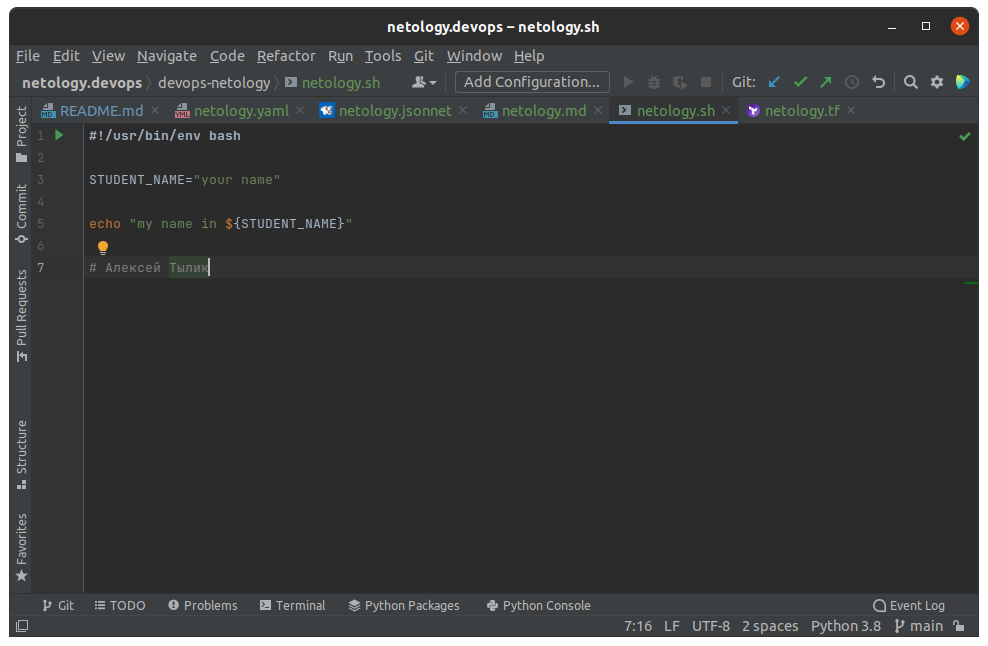
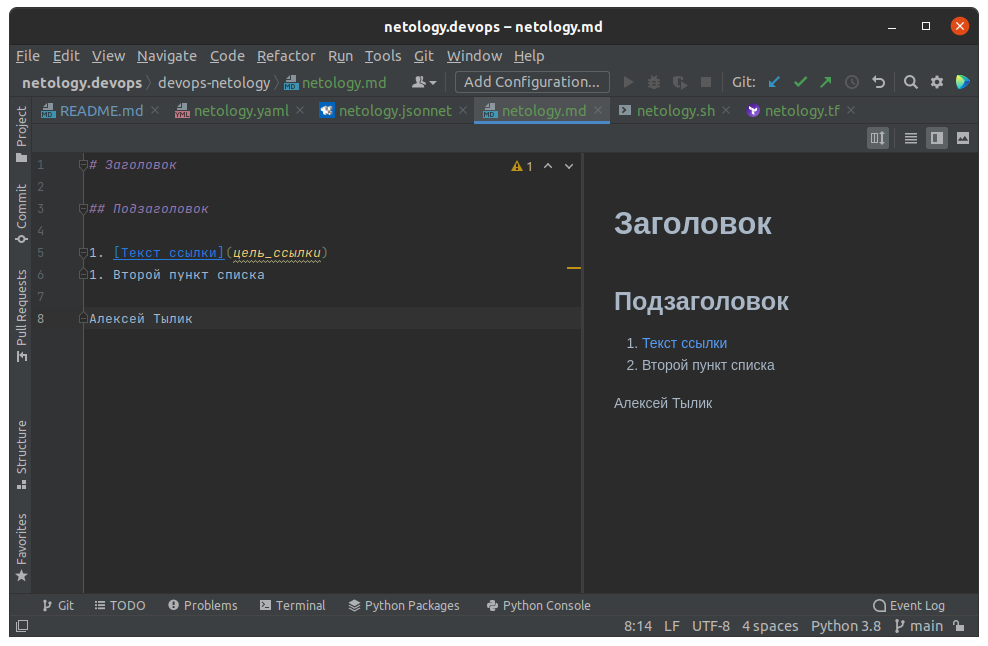
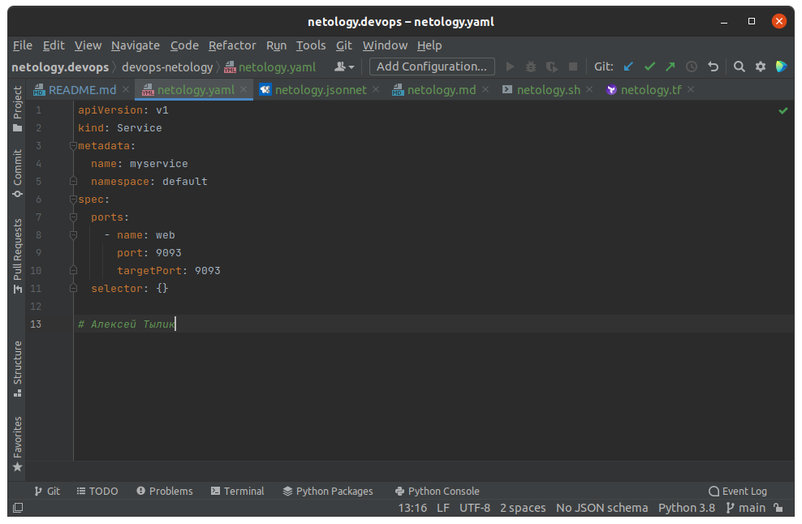
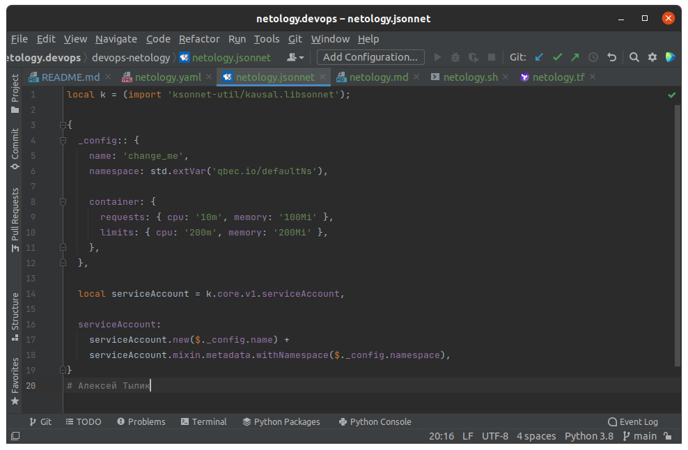

# devops-netology 
## DEVSYS-PSD-2  Тылик Алексей

---

# Домашнее задание к занятию «1.1. Введение в DevOps»

## Задание №1 - Подготовка рабочей среды
### Настрка окружение для дальнейшей работы. 

1. - [x] Установить PyCharm Community Edition
2. Установить плагины:
    - [x] Terraform,
    - [x] MarkDown,
    - [x] Yaml/Ansible Support,
    - [x] Jsonnet.
3. Убедица, что работает подсветка синтаксиса, файлы выглядят вот так:
   - [Terraform](netology.tf): 
   - [Bash](netology.sh): 
   - [Markdown](netology.md): 
   - [Yaml](netology.yaml): 
   - [Jsonnet](netology.jsonnet): 

## Задание №2 - Описание жизненного цикла задачи (разработки нового функционала)

### Описание истории

Представьте, что вы работаете в стартапе, который запустил интернет-магазин. Ваш интернет-магазин достаточно успешно развивался, и вот пришло время налаживать процессы: у вас стало больше конечных клиентов, менеджеров и разработчиков.Сейчас от клиентов вам приходят задачи, связанные с разработкой нового функционала. Задач много, и все они требуют выкладки на тестовые среды, одобрения тестировщика, проверки менеджером перед показом клиенту. В случае необходимости, вам будет необходим откат изменений. 

### Решение задачи
1. PLAN Собраться командой выбрать новый функционал ,помочь выбрать необходимые технологии разработки  (разработчики проробатывают архетектуру, делят задачи на мелкиие )
2. CODE Сформированные мелкие задачи пишут разработчики, помочь не забывать писать тесты, контролировать единообразия кода контролировать версии и слияния кода 
3. BUILD непрерывная интеграция сборок контроль исправности всех пакетов 
4. TEST проверить что все тесты корекны если нет отправить на доработку 
5. RElEASE утверждения выпуска с Заказчиком, автоматизация выпуска  
6. DEPlLY Развертывание новой версии сайта
8. MONITOR мониторинг производительности приложений, взаимодействия с конечным пользователем

