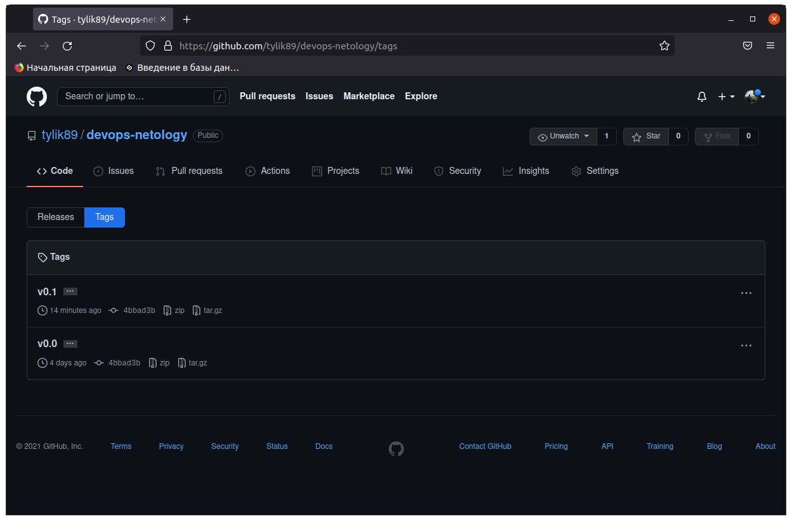
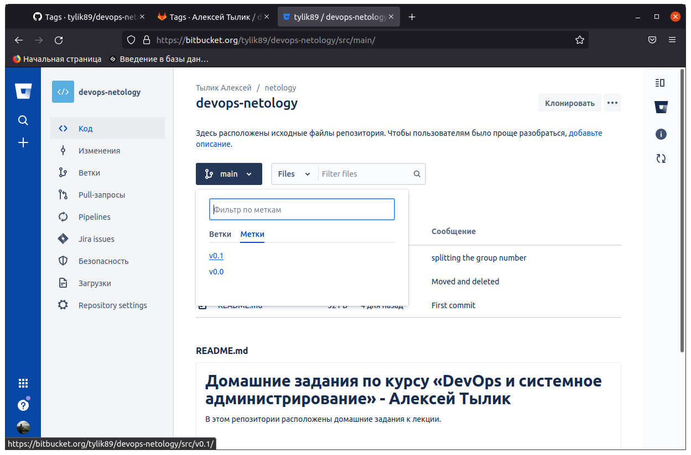
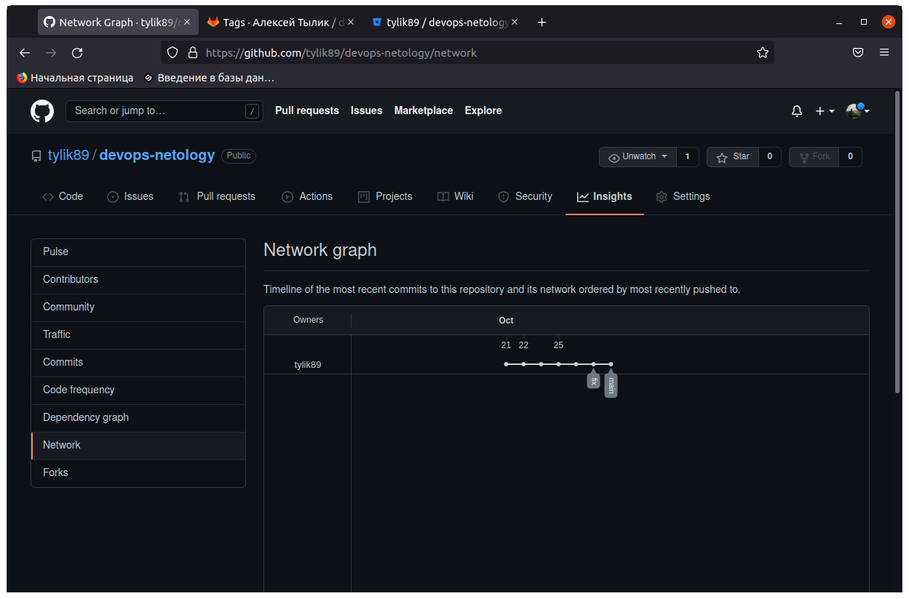
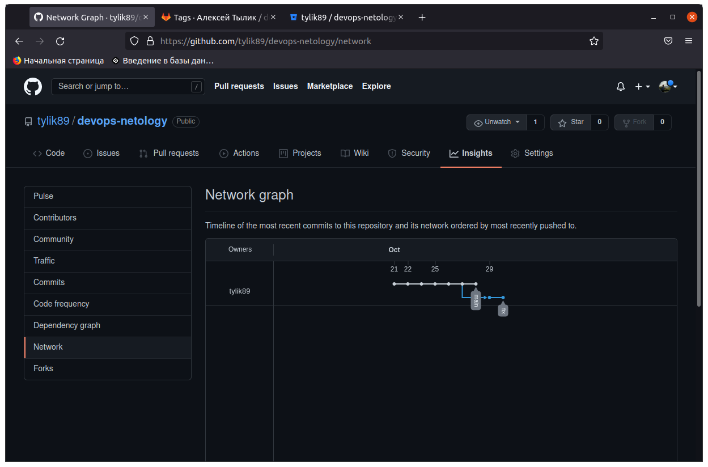

# Домашнее задание к занятию «2.2. Основы Git» - Алексей Тылик 

Cсылки на все три репозитория в [github](https://github.com/tylik89/devops-netology), [gitlab](https://gitlab.com/tylik89/devops-netology) , [bitbucket](https://bitbucket.org/tylik89/devops-netology/src)

## Задание №1 – Знакомимся с gitlab и bitbucket 

1. Создадим аккаунт в gitlab: @tylik89
2. Cоздадим открытый новый проект [devops-netology](https://gitlab.com/tylik89/devops-netology) на GitLab
3. Выпоним команду  `git remote -v`.

```bash
$ git remote -v
origin  git@github.com:tylik89/devops-netology.git (fetch)
origin  git@github.com:tylik89/devops-netology.git (push)

```

5. Добавим [devops-netology](https://gitlab.com/tylik89/devops-netology)  репозиторий как дополнительный `remote` к созданному
репозиторию в рамках предыдущего домашнего задания:
`git remote add gitlab git@gitlab.com:tylik89/devops-netology.git`.
6. Отпраим изменения в новый удалённый репозиторий `git push -u gitlab main`.
7. Посмотрим как изменился результат работы команды `git remote -v`.

```bash
$ git remote -v
gitlab  git@gitlab.com:tylik89/devops-netology.git (fetch)
gitlab  git@gitlab.com:tylik89/devops-netology.git (push)
origin  git@github.com:tylik89/devops-netology.git (fetch)
origin  git@github.com:tylik89/devops-netology.git (push)
```

Теперь необходимо проделать все тоже самое с https://bitbucket.org/. 
1. Создадим аккаунт в [id.atlassian.com](https://id.atlassian.com) : tylik89@yandex.ru
2. Cоздадим открытый новый проект [netology](https://bitbucket.org/tylik89/workspace/projects/NET)  и репозиторий [devops-netology](https://bitbucket.org/tylik89/devops-netology/src)
3. Добавим [devops-netology](https://bitbucket.org/tylik89/devops-netology/src)  репозиторий как дополнительный `remote` к созданному
репозиторию в рамках предыдущего домашнего задания:
`git remote add bitbucket git@bitbucket.org:tylik89/devops-netology.git`.
4. Отпраим изменения в новый удалённый репозиторий `git push -u bitbucket main`.
5. Посмотрим как изменился результат работы команды `git remote -v`.

```bash
$ git remote -v
bitbucket       git@bitbucket.org:tylik89/devops-netology.git (fetch)
bitbucket       git@bitbucket.org:tylik89/devops-netology.git (push)
gitlab  git@gitlab.com:tylik89/devops-netology.git (fetch)
gitlab  git@gitlab.com:tylik89/devops-netology.git (push)
origin  git@github.com:tylik89/devops-netology.git (fetch)
origin  git@github.com:tylik89/devops-netology.git (push)

```
---
## Задание №2 – Теги

1. Создадим легковестный тег `v0.0` на HEAD коммите
```bash
$ git tag v0.0
$ git show v0.0
gcommit 4bbad3b92553fcffc59a2d04a61d773e0eaf44ea (HEAD -> main, tag: v0.0, origin/main, origin/HEAD, gitlab/main, bitbucket/main)
Author: Alexey Tylik <tylik89@yandex.ru>
Date:   Mon Oct 25 16:49:02 2021 +0500

    Moved and deleted

diff --git a/02_git_01_vcs/will_be_moved.txt b/02_git_01_vcs/has_been_moved.txt
similarity index 100%
rename from 02_git_01_vcs/will_be_moved.txt
rename to 02_git_01_vcs/has_been_moved.txt
diff --git a/02_git_01_vcs/will_be_deleted.txt b/02_git_01_vcs/will_be_deleted.txt
deleted file mode 100644
index ee10159..0000000
:
```
 Запушем его во все три добавленных на предыдущем этапе `upstream`
```bash
$ git push origin v0.0 && git push gitlab v0.0 && git push bitbucket v0.0
Всего 0 (изменения 0), повторно использовано 0 (изменения 0)
To github.com:tylik89/devops-netology.git
 * [new tag]         v0.0 -> v0.0
Всего 0 (изменения 0), повторно использовано 0 (изменения 0)
To gitlab.com:tylik89/devops-netology.git
 * [new tag]         v0.0 -> v0.0
Всего 0 (изменения 0), повторно использовано 0 (изменения 0)
To bitbucket.org:tylik89/devops-netology.git
 * [new tag]         v0.0 -> v0.0
```

2. Создадим аннотированный тег `v0.1`.
```bash
$ git tag -a v0.1 -m"my version 0.1"
$ git show v0.1
tag v0.1
Tagger: Alexey Tylik <tylik89@yandex.ru>
Date:   Fri Oct 29 17:21:52 2021 +0500

my version 0.1

commit 4bbad3b92553fcffc59a2d04a61d773e0eaf44ea (HEAD -> main, tag: v0.1, tag: v0.0, origin/main, origin/HEAD, gitlab/main, bitbucket/main)
Author: Alexey Tylik <tylik89@yandex.ru>
Date:   Mon Oct 25 16:49:02 2021 +0500

    Moved and deleted

diff --git a/02_git_01_vcs/will_be_moved.txt b/02_git_01_vcs/has_been_moved.txt
similarity index 100%
:
```
его также запушим 
```bash
$ git push origin v0.1 && git push gitlab v0.1 && git push bitbucket v0.1
Перечисление объектов: 1, готово.
Подсчет объектов: 100% (1/1), готово.
Запись объектов: 100% (1/1), 165 байтов | 165.00 КиБ/с, готово.
Всего 1 (изменения 0), повторно использовано 0 (изменения 0)
To github.com:tylik89/devops-netology.git
 * [new tag]         v0.1 -> v0.1
Перечисление объектов: 1, готово.
Подсчет объектов: 100% (1/1), готово.
Запись объектов: 100% (1/1), 165 байтов | 165.00 КиБ/с, готово.
Всего 1 (изменения 0), повторно использовано 0 (изменения 0)
To gitlab.com:tylik89/devops-netology.git
 * [new tag]         v0.1 -> v0.1
Перечисление объектов: 1, готово.
Подсчет объектов: 100% (1/1), готово.
Запись объектов: 100% (1/1), 165 байтов | 165.00 КиБ/с, готово.
Всего 1 (изменения 0), повторно использовано 0 (изменения 0)
To bitbucket.org:tylik89/devops-netology.git
 * [new tag]         v0.1 -> v0.1

```

3. Перейдем на страницу просмотра тегов в гитхабе (и в других репозиториях) и посмотрим, чем отличаются созданные теги. 
    * [В гитхабе](https://github.com/tylik89/devops-netology/tags) 
      
    * [В гитлабе](https://gitlab.com/tylik89/devops-netology/-/tags) 
      
    * [В битбакете](https://bitbucket.org/tylik89/devops-netology/src/v0.1/)  – список тегов расположен в выпадающем меню веток на отдельной вкладке.
      

## Задание №3 – Ветки 

Давайте посмотрим, как будет выглядеть история коммитов при создании веток. 

1. Переключимся обратно на ветку `main`, которая должна быть связана с веткой `main` репозитория на `github`.
```bash
$ git checkout main
M       README.md
Переключено на ветку «main»
Ваша ветка обновлена в соответствии с «bitbucket/main».
```
2. Посмотрим  лог коммитов и найдем хеш коммита с названием `Prepare to delete and move`, который был создан в пределах предыдущего домашнего задания. 
```bash
$ git log --oneline
7b13d99 (HEAD -> main) part of homework 02_git_02_base
4bbad3b (tag: v0.1, tag: v0.0, origin/main, origin/HEAD, gitlab/main, bitbucket/main) Moved and deleted
c9ff4b9 Prepare to delete and move
655baa3 Added gitignore
112a295 First commit
ba4487b splitting the group number
f62c70b the first version of homework
be14fc0 Initial commit
```
3. Выполним `git checkout` по хешу найденного коммита. 

```bash
$ git checkout -f c9ff4b9
Note: switching to 'c9ff4b9'.

You are in 'detached HEAD' state. You can look around, make experimental
changes and commit them, and you can discard any commits you make in this
state without impacting any branches by switching back to a branch.

If you want to create a new branch to retain commits you create, you may
do so (now or later) by using -c with the switch command. Example:

  git switch -c <new-branch-name>

Or undo this operation with:

  git switch -

Turn off this advice by setting config variable advice.detachedHead to false

HEAD сейчас на c9ff4b9 Prepare to delete and move

```
4. Создайте новую ветку `fix` базируясь на этом коммите `git switch -c fix`.
```bash
$ git switch -c fix
Переключено на новую ветку «fix»

```
5. Отправьте новую ветку в репозиторий на гитхабе `git push -u origin fix`.
```bash
$ git push -u origin fix
Всего 0 (изменения 0), повторно использовано 0 (изменения 0)
remote: 
remote: Create a pull request for 'fix' on GitHub by visiting:
remote:      https://github.com/tylik89/devops-netology/pull/new/fix
remote: 
To github.com:tylik89/devops-netology.git
 * [new branch]      fix -> fix
Ветка «fix» отслеживает внешнюю ветку «fix» из «origin».

```
6. Посмотрим, как визуально выглядит  схема коммитов: https://github.com/tylik89/devops-netology/network
       

7. Теперь измените содержание файла `02_git_01_vcs/README.md`, добавив новую строчку.
```bash
$ echo "new line" >>02_git_01_vcs/README.md
```
9. Отправим изменения в репозитория  посмотрим, как изменится схема на странице https://github.com/YOUR_ACCOUNT/devops-netology/network 
```bash
$ git commit
[fix f61c582] new line in 02-git-01
 1 file changed, 2 insertions(+), 1 deletion(-)
$ git push -u origin fix
Перечисление объектов: 11, готово.
Подсчет объектов: 100% (11/11), готово.
При сжатии изменений используется до 6 потоков
Сжатие объектов: 100% (8/8), готово.
Запись объектов: 100% (8/8), 796 байтов | 796.00 КиБ/с, готово.
Всего 8 (изменения 4), повторно использовано 0 (изменения 0)
remote: Resolving deltas: 100% (4/4), completed with 2 local objects.
To github.com:tylik89/devops-netology.git
   c9ff4b9..f61c582  fix -> fix
Ветка «fix» отслеживает внешнюю ветку «fix» из «origin».

```
посмотрим, как изменится схема на странице https://github.com/YOUR_ACCOUNT/devops-netology/network
 
и как изменится вывод команды `git log`.
```bash
$ git log --oneline
7b13d99 (HEAD -> main) part of homework 02_git_02_base
4bbad3b (tag: v0.1, tag: v0.0, origin/main, origin/HEAD, gitlab/main, bitbucket/main) Moved and deleted
c9ff4b9 Prepare to delete and move
655baa3 Added gitignore
112a295 First commit
ba4487b splitting the group number
f62c70b the first version of homework
be14fc0 Initial commit
:...skipping...
7b13d99 (HEAD -> main) part of homework 02_git_02_base
4bbad3b (tag: v0.1, tag: v0.0, origin/main, origin/HEAD, gitlab/main, bitbucket/main) Moved and deleted
c9ff4b9 Prepare to delete and move
655baa3 Added gitignore
112a295 First commit
ba4487b splitting the group number
f62c70b the first version of homework
be14fc0 Initial commit
~

```

