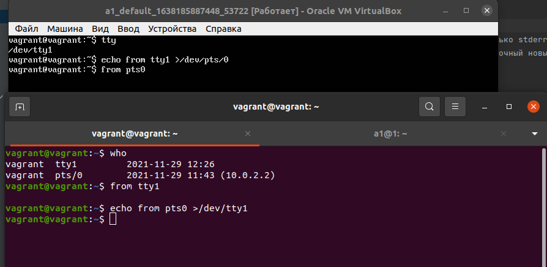

# Домашнее задание к занятию "3.2. Работа в терминале, лекция 2"


###1. Какого типа команда `cd`? Попробуйте объяснить, почему она именно такого типа; опишите ход своих мыслей, если считаете что она могла бы быть другого типа.

Узнать тип команды можно спомошью команды `type`
```shell
$ type cd
cd — это встроенная команда bash
```
 Встроенные команды содержатся в самой оболочке. Когда имя встроенной команды используется в качестве первого слова простой команды,
 оболочка выполняет команду напрямую, не вызывая другую программу. 
 Встроенные команды необходимы для реализации функций, которые невозможно или неудобно получить с помощью отдельных утилит.

Если внешняя команда изменила каталог, она не влияет на родительский shell.

---
###2. Какая альтернатива без pipe команде `grep <some_string> <some_file> | wc -l`? `man grep` поможет в ответе на этот вопрос. Ознакомьтесь с [документом](http://www.smallo.ruhr.de/award.html) о других подобных некорректных вариантах использования pipe.


Если нужно просто узнать количество строк с совпадениями можно использовать флаг `-c`
grep <some string> <some file> -c 

---
###3. Какой процесс с PID `1` является родителем для всех процессов в вашей виртуальной машине Ubuntu 20.04?

Команда `pstree ` отображает иерархическую древовидную структуру всех запущенных процессов,
флаг  `-p` инструктирует pstree показать PID
```shell
$ pstree -p
systemd(1)─┬─ModemManager(817)─┬─{ModemManager}(887)
           │                   └─{ModemManager}(889)
           ├─NetworkManager(673)─┬─{NetworkManager}(818)
           │                     └─{NetworkManager}(819)
...           
```
systemd - является родителем для всех процессов 

---
###4. Как будет выглядеть команда, которая перенаправит вывод stderr `ls` на другую сессию терминала?
```shell
$ tty
/dev/pts/0
$ ls 1/2 2>/dev/pts/1
```
```shell
$ tty
/dev/pts/1
$ ls: невозможно получить доступ к '1/2': Нет такого файла или каталога
```

---
###5. Получится ли одновременно передать команде файл на stdin и вывести ее stdout в другой файл? Приведите работающий пример.

```shell
$ echo test_1 >to_stdin
$ cat <to_stdin >test_out
$ cat test_out
test_1
```
```bash
$ echo test_1 >to_stdin |
$ cat <to_stdin >test_out
$ cat test_out
test_1
```
---
###6. Получится ли вывести находясь в графическом режиме данные из PTY в какой-либо из эмуляторов TTY? Сможете ли вы наблюдать выводимые данные?


```shell
vagrant@vagrant:~$ echo from tty1 >/dev/pts/0
vagrant@vagrant:~$ from pts0 
```

```shell
vagrant@vagrant:~$ who
vagrant  tty1         2021-11-29 12:26
vagrant  pts/0        2021-11-29 11:43 (10.0.2.2)
vagrant@vagrant:~$ from tty1

vagrant@vagrant:~$ echo from pts0 >/dev/tty1
```



---
###7. Выполните команду `bash 5>&1`. К чему она приведет? Что будет, если вы выполните `echo netology > /proc/$$/fd/5`? Почему так происходит?

```shell
$ bash 5>&1
$ echo netology > /proc/$$/fd/5
netology
```
Команда `bash 5>&1` создает новый дескритор 5 и связывает его со стандартным дескриптором вывода. 
Теперь если выполнить `echo netology > /proc/$$/fd/5` то bash продублирует вывод команды echo на стандартное 
устройство вывода, а не только в файл.

---
###8. Получится ли в качестве входного потока для pipe использовать только stderr команды, не потеряв при этом отображение stdout на pty? Напоминаем: по умолчанию через pipe передается только stdout команды слева от `|` на stdin команды справа.

Это можно сделать, поменяв стандартные потоки местами через промежуточный новый дескриптор

```shell
# Для начала надо сделать конструкцию, которая будет выдавать и ошибку и обычный вывод
vagrant@vagrant:~$ mkdir test_1
vagrant@vagrant:~$ (ls && ls -test_1)
test_1
ls: invalid option -- 'e'
Try 'ls --help' for more information.
# результатом будет вывод в консоль состава директории и цифры 2
# количество строк из ошибки где встречалось ls
vagrant@vagrant:~$ (ls && ls -test_1) 3>&2 2>&1 1>&3 | grep -c 'ls'
test_1
2
```
Таким образом мы передали на вход через пайп stderr, при этом не потеряв вывод stdout в консоль.

---
###9. Что выведет команда `cat /proc/$$/environ`? Как еще можно получить аналогичный по содержанию вывод?

Команда `cat /proc/$$/environ` эквивалентна команде `env` без аргументов и выводит список переменных окружения
и их значений, также `printenv` - вывод переменных среды.

---
###10. Используя `man`, опишите что доступно по адресам `/proc/<PID>/cmdline`, `/proc/<PID>/exe`.

`/proc/<PID>/cmdline` - 'этот файл содержит полную командную строку запуска процесса.

`/proc/<PID>/exe` - является символьной ссылкой, содержащей фактическое полное имя выполняемого файла.

---
###11. Узнайте, какую наиболее старшую версию набора инструкций SSE поддерживает ваш процессор с помощью `/proc/cpuinfo`.

```shell
vagrant@vagrant:~$ grep sse /proc/cpuinfo
flags		: fpu vme de pse tsc msr pae mce cx8 apic sep mtrr pge mca cmov pat pse36 clflush mmx fxsr sse sse2 ht syscall nx rdtscp lm constant_tsc rep_good nopl xtopology nonstop_tsc cpuid tsc_known_freq pni ssse3 cx16 pcid sse4_1 sse4_2 x2apic hypervisor lahf_lm invpcid_single pti fsgsbase invpcid md_clear flush_l1d
flags		: fpu vme de pse tsc msr pae mce cx8 apic sep mtrr pge mca cmov pat pse36 clflush mmx fxsr sse sse2 ht syscall nx rdtscp lm constant_tsc rep_good nopl xtopology nonstop_tsc cpuid tsc_known_freq pni ssse3 cx16 pcid sse4_1 sse4_2 x2apic hypervisor lahf_lm invpcid_single pti fsgsbase invpcid md_clear flush_l1d
```
Версию sse4_2

---
###12. При открытии нового окна терминала и `vagrant ssh` создается новая сессия и выделяется pty. Это можно подтвердить командой `tty`, которая упоминалась в лекции 3.2. Однако:

     ```bash
     vagrant@netology1:~$ ssh localhost 'tty'
     not a tty
     ```

     Почитайте, почему так происходит, и как изменить поведение.

Если запрашивается интерактивный сеанс, ssh по умолчанию запрашивает только псевдотерминал (pty). 
Принудительно создать (tty) можно ключом -T и -t .
```shell
vvagrant@vagrant:~$ ssh -t localhost tty
vagrant@localhost's password: 
/dev/pts/1
Connection to localhost closed.
```
---
###13. Бывает, что есть необходимость переместить запущенный процесс из одной сессии в другую. Попробуйте сделать это, воспользовавшись `reptyr`. Например, так можно перенести в `screen` процесс, который вы запустили по ошибке в обычной SSH-сессии.


---
###14. `sudo echo string > /root/new_file` не даст выполнить перенаправление под обычным пользователем, так как перенаправлением занимается процесс shell'а, который запущен без `sudo` под вашим пользователем. Для решения данной проблемы можно использовать конструкцию `echo string | sudo tee /root/new_file`. Узнайте что делает команда `tee` и почему в отличие от `sudo echo` команда с `sudo tee` будет работать.


---
 