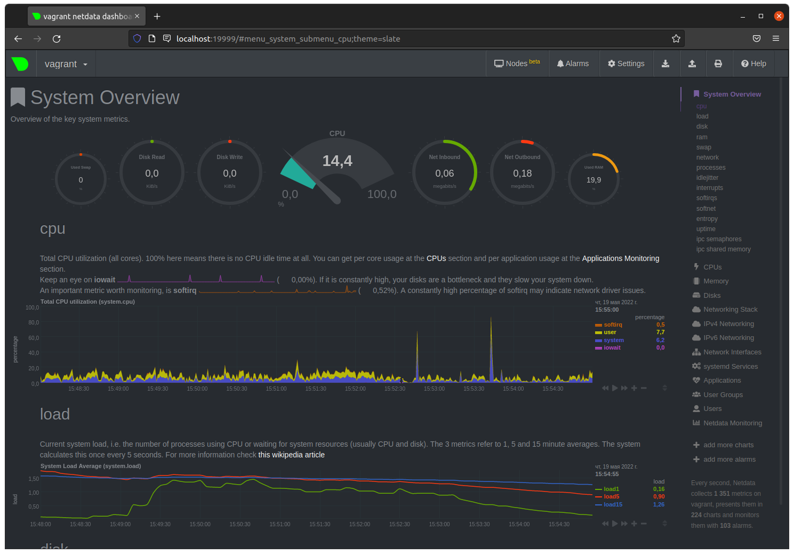

# Домашнее задание к занятию "3.4. Операционные системы, лекция 2"

1. На лекции мы познакомились с [node_exporter](https://github.com/prometheus/node_exporter/releases). В демонстрации его исполняемый файл запускался в background. Этого достаточно для демо, но не для настоящей production-системы, где процессы должны находиться под внешним управлением. Используя знания из лекции по systemd, создайте самостоятельно простой [unit-файл](https://www.freedesktop.org/software/systemd/man/systemd.service.html) для node_exporter:

    * поместите его в автозагрузку,
    * предусмотрите возможность добавления опций к запускаемому процессу через внешний файл (посмотрите, например, на `systemctl cat cron`),
    * удостоверьтесь, что с помощью systemctl процесс корректно стартует, завершается, а после перезагрузки автоматически поднимается.

```shell
wget https://github.com/prometheus/node_exporter/releases/download/v1.3.1/node_exporter-1.3.1.linux-amd64.tar.gz
tar xvfz node_exporter-1.3.1.linux-amd64.tar.gz 
sudo cp -r node_exporter-1.3.1.linux-amd64 /usr/local/bin/ 
предусмортрим возможность добавления опций к запускаемому процессу через внешний файл
~$ cat /opt/node_exporter.env 
EXTRA_OPTS="--log.level=info"
создадим Файл конфигурации модуля
[Unit]
Description= Node Exporter  
After=network.target  
   
[Service]  
Type=simple  
EnvironmentFile=/opt/node_exporter.env 
ExecStart=/usr/local/bin/node_exporter-1.3.1.linux-amd64/node_exporter  $EXTRA_OPTS
   
[Install]  
WantedBy=multi-user.target 

запустим службу 

vagrant@vagrant:~$ sudo systemctl daemon-reload
vagrant@vagrant:~$ sudo systemctl start node_exporter
vagrant@vagrant:~$ sudo systemctl enable node_exporter
Created symlink /etc/systemd/system/multi-user.target.wants/node_exporter.service → /etc/systemd/system/node_exporter.service.
vagrant@vagrant:~$ sudo systemctl status node_exporter
● node_exporter.service - Node Exporter
     Loaded: loaded (/etc/systemd/system/node_exporter.service; enabled; vendor preset: enabled)
     Active: active (running) since Thu 2022-05-19 07:32:08 UTC; 52s ago
   Main PID: 1492 (node_exporter)
      Tasks: 5 (limit: 1071)
     Memory: 2.7M
     CGroup: /system.slice/node_exporter.service
             └─1492 /usr/local/bin/node_exporter-1.3.1.linux-amd64/node_exporter --log.level=info

проверим после перезагрузки 

vagrant@vagrant:~$ exit 
logout
Connection to 127.0.0.1 closed.
a1@a1:~/03-sysadmin-04$ vagrant reload
...
vagrant@vagrant:~$ sudo systemctl status node_exporter
● node_exporter.service - Node Exporter
     Loaded: loaded (/etc/systemd/system/node_exporter.service; enabled; vendor preset: enabled)
     Active: active (running) since Thu 2022-05-19 07:44:56 UTC; 1min 53s ago
   Main PID: 613 (node_exporter)
      Tasks: 4 (limit: 1071)
     Memory: 14.3M
     CGroup: /system.slice/node_exporter.service
             └─613 /usr/local/bin/node_exporter-1.3.1.linux-amd64/node_exporter --log.level=info

```
---
2. Ознакомьтесь с опциями node_exporter и выводом `/metrics` по-умолчанию. Приведите несколько опций, которые вы бы выбрали для базового мониторинга хоста по CPU, памяти, диску и сети.

Процессор
 ```
  node_cpu_seconds_total{cpu="0",mode="idle"} 5026.4
  node_cpu_seconds_total{cpu="0",mode="system"} 56.58
  node_cpu_seconds_total{cpu="0",mode="user"} 4.84
  node_cpu_seconds_total{cpu="1",mode="idle"} 5025.01
  node_cpu_seconds_total{cpu="1",mode="system"} 13.46
  node_cpu_seconds_total{cpu="1",mode="user"} 1.61
  process_cpu_seconds_total 3
 ```
 
Oбъем памяти
  ```
  node_memory_MemTotal_bytes 1.028694016e+09
  node_memory_MemFree_bytes 5.68066048e+08
  node_memory_MemAvailable_bytes 7.6163072e+08
  node_memory_Buffers_bytes 2.3498752e+07
  node_memory_Cached_bytes 2.90205696e+08 
  ```
Диск
  ```
  node_disk_io_time_seconds_total{device="sda"} 12.012
  node_disk_read_bytes_total{device="sda"} 3.16904448e+08
  node_disk_read_time_seconds_total{device="sda"} 7.303
  node_disk_written_bytes_total{device="sda"} 7.4236928e+07
  node_disk_write_time_seconds_total{device="sda"} 7.746
  ```
Сеть
  ```
  node_network_receive_bytes_total{device="eth0"} 545686
  node_network_receive_errs_total{device="eth0"} 0
  node_network_transmit_bytes_total{device="eth0"} 434942
  node_network_transmit_errs_total{device="eth0"} 0
  ```
---
3. Установите в свою виртуальную машину [Netdata](https://github.com/netdata/netdata). Воспользуйтесь [готовыми пакетами](https://packagecloud.io/netdata/netdata/install) для установки (`sudo apt install -y netdata`). После успешной установки:
    * в конфигурационном файле `/etc/netdata/netdata.conf` в секции [web] замените значение с localhost на `bind to = 0.0.0.0`,
    * добавьте в Vagrantfile проброс порта Netdata на свой локальный компьютер и сделайте `vagrant reload`:

    ```bash
    config.vm.network "forwarded_port", guest: 19999, host: 19999
    ```

    После успешной перезагрузки в браузере *на своем ПК* (не в виртуальной машине) вы должны суметь зайти на `localhost:19999`. Ознакомьтесь с метриками, которые по умолчанию собираются Netdata и с комментариями, которые даны к этим метрикам.

---

4. Можно ли по выводу `dmesg` понять, осознает ли ОС, что загружена не на настоящем оборудовании, а на системе виртуализации?
 
да, можно
```
vagrant@vagrant:~$ dmesg 
[    0.000000] DMI: innotek GmbH VirtualBox/VirtualBox, BIOS VirtualBox 12/01/2006
[    0.000000] Hypervisor detected: KVM
[    0.006525] CPU MTRRs all blank - virtualized system.
[    0.398245] Booting paravirtualized kernel on KVM
[   22.228574] systemd[1]: Detected virtualization oracle.
```

---
5. Как настроен sysctl `fs.nr_open` на системе по-умолчанию? Узнайте, что означает этот параметр. Какой другой существующий лимит не позволит достичь такого числа (`ulimit --help`)?

`fs.nr_open`- лимит на количество открытых дескрипторов ядра системы 

```
vagrant@vagrant:~$ sysctl -n fs.nr_open
1048576
```
`ulimit -n` - максимальное количество активных файлов дескрипторов (большинство систем не позволяет использовать это значение)
`ulimit -Hn`- жесткое отказ после установки превосходить нельзя; 
`ulimit -Sn`- мягко упустить можно превосходить до значения очень жесткого ограничения.

---
6. Запустите любой долгоживущий процесс (не `ls`, который отработает мгновенно, а, например, `sleep 1h`) в отдельном неймспейсе процессов; покажите, что ваш процесс работает под PID 1 через `nsenter`. Для простоты работайте в данном задании под root (`sudo -i`). Под обычным пользователем требуются дополнительные опции (`--map-root-user`) и т.д.

/dev/pts/0
```commandline
root@vagrant:~# sudo unshare -f --pid --mount-proc /bin/bash
root@vagrant:~# ps aux
USER         PID %CPU %MEM    VSZ   RSS TTY      STAT START   TIME COMMAND
root           1  0.2  0.4   7236  4128 pts/0    S    05:41   0:00 /bin/bash
root           9  0.0  0.3   8892  3380 pts/0    R+   05:42   0:00 ps aux
root@vagrant:~# sleep 1h
 ```
/dev/pts/1
```commandline
root@vagrant:~# ps aux 
...
root        1912  0.0  0.0   5476   592 pts/0    S+   05:55   0:00 sleep 1h
root@vagrant:~# nsenter --target 1912 --pid --mount
root@vagrant:/# ps aux
USER         PID %CPU %MEM    VSZ   RSS TTY      STAT START   TIME COMMAND
root           1  0.0  0.4   7236  4128 pts/0    S    05:41   0:00 /bin/bash
root          17  0.0  0.0   5476   592 pts/0    S+   05:55   0:00 sleep 1h
root          18  1.6  0.4   7236  4028 pts/1    S    06:05   0:00 -bash
root          29  0.0  0.3   8892  3376 pts/1    R+   06:05   0:00 ps aux
root@vagrant:/# 

 ```
---
7. Найдите информацию о том, что такое `:(){ :|:& };:`. Запустите эту команду в своей виртуальной машине Vagrant с Ubuntu 20.04 (**это важно, поведение в других ОС не проверялось**). Некоторое время все будет "плохо", после чего (минуты) – ОС должна стабилизироваться. Вызов `dmesg` расскажет, какой механизм помог автоматической стабилизации. Как настроен этот механизм по-умолчанию, и как изменить число процессов, которое можно создать в сессии?

 
Это концепция `Fork Bomb` —  маленькая программа, которая порождает себя n-раз, отбросив цепную реакцию (рекурсия) и тем самым быстро исчерпав ресурсы системы.

Где:
`:()` — Определение функции.
`{ ` — Открытие функции.
`:|: `— Далее, загружает копию функции «:» в память тем самым, будет вызывать само себя с использованием техники программирования ( так называемая рекурсия) и передает результат на другой вызов функции.
`‘:’`— Худшая часть — функция, вызываемая два раза, чтобы «бомбить» вашу систему.
`& `— Помещает вызов функции в фоновом режиме, чтобы fork (дочерний процесс) не мог «умереть» вообще, тем самым это начнет есть системные ресурсы.
`} `— Закрытие функции.
`;` — Завершите определение функции. Т.е является разделителем команд, (такой как и &&).
`:` — Запускает функцию которая порождает fork bomb().

сработал механизм сгрупп - это способ сократить ресурсы внутри конкретной группы (контроль групповых процессов)
```
vagrant@vagrant:~$ dmesg -T
...
[Fri May 20 06:29:04 2022] cgroup: fork rejected by pids controller in /user.slice/user-1000.slice/session-4.scope
```

 Cработал механизм групп - это способ сократить ресурсы внутри конкретной группы(max user processes )
```commandline
vagrant@vagrant:~$ ulimit -a
core file size          (blocks, -c) 0
data seg size           (kbytes, -d) unlimited
scheduling priority             (-e) 0
file size               (blocks, -f) unlimited
pending signals                 (-i) 3571
max locked memory       (kbytes, -l) 65536
max memory size         (kbytes, -m) unlimited
open files                      (-n) 1024
pipe size            (512 bytes, -p) 8
POSIX message queues     (bytes, -q) 819200
real-time priority              (-r) 0
stack size              (kbytes, -s) 8192
cpu time               (seconds, -t) unlimited
max user processes              (-u) 3571
virtual memory          (kbytes, -v) unlimited
file locks                      (-x) unlimited
```
изминить можно здесь: `/etc/security/limits.conf`

---


