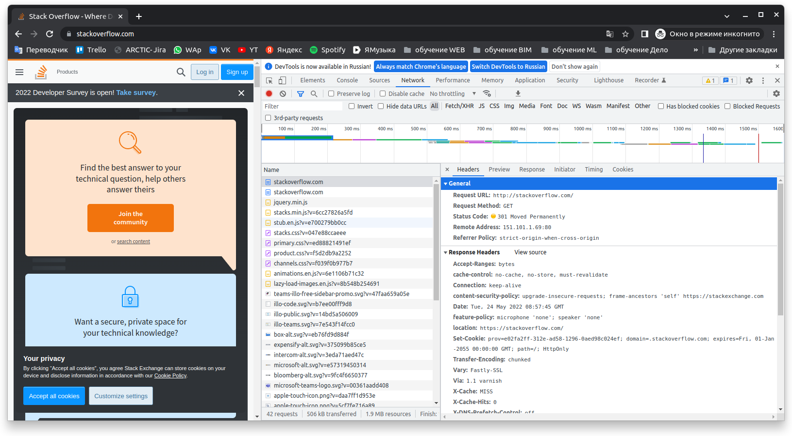
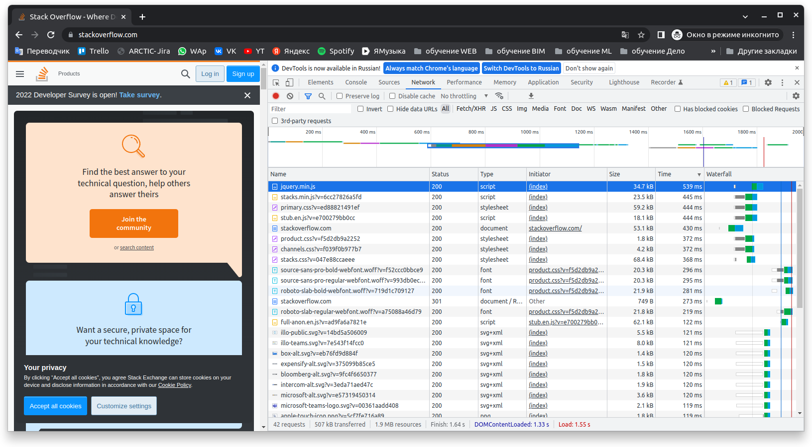

# Домашнее задание к занятию "3.6. Компьютерные сети, лекция 1"

1. Работа c HTTP через телнет.
- Подключитесь утилитой телнет к сайту stackoverflow.com
`telnet stackoverflow.com 80`
- отправьте HTTP запрос
```bash
GET /questions HTTP/1.0
HOST: stackoverflow.com
[press enter]
[press enter]
```
```bash
a1@a1:~$ telnet stackoverflow.com 80
Trying 151.101.1.69...
Connected to stackoverflow.com.
Escape character is '^]'.
GET /questions HTTP/1.0
HOST: stackoverflow.com

HTTP/1.1 301 Moved Permanently
cache-control: no-cache, no-store, must-revalidate
location: https://stackoverflow.com/questions
x-request-guid: e7918c84-1294-40e7-aa76-aaf78019cc1f
feature-policy: microphone 'none'; speaker 'none'
content-security-policy: upgrade-insecure-requests; frame-ancestors 'self' https://stackexchange.com
Accept-Ranges: bytes
Date: Tue, 24 May 2022 08:06:14 GMT
Via: 1.1 varnish
Connection: close
X-Served-By: cache-ams21073-AMS
X-Cache: MISS
X-Cache-Hits: 0
X-Timer: S1653379574.444973,VS0,VE73
Vary: Fastly-SSL
X-DNS-Prefetch-Control: off
Set-Cookie: prov=dc2a0553-c36a-b330-0a10-117b88517783; domain=.stackoverflow.com; expires=Fri, 01-Jan-2055 00:00:00 GMT; path=/; HttpOnly

Connection closed by foreign host.
```
301  редирект — это перенаправление на другой адрес сайта.
Редирект 301 указывает на постоянное перемещение веб-страницы из одного места в другое.
Адрес нового месторасположения Location: https://stackoverflow.com/questions

---
2. Повторите задание 1 в браузере, используя консоль разработчика F12.
- откройте вкладку `Network`
- отправьте запрос http://stackoverflow.com
- найдите первый ответ HTTP сервера, откройте вкладку `Headers`
- укажите в ответе полученный HTTP код.


```html
Request URL: http://stackoverflow.com/
Request Method: GET
Status Code: 301 Moved Permanently
Remote Address: 151.101.1.69:80
Referrer Policy: strict-origin-when-cross-origin
Accept-Ranges: bytes
cache-control: no-cache, no-store, must-revalidate
Connection: keep-alive
content-security-policy: upgrade-insecure-requests; frame-ancestors 'self' https://stackexchange.com
Date: Tue, 24 May 2022 08:57:45 GMT
feature-policy: microphone 'none'; speaker 'none'
location: https://stackoverflow.com/
Set-Cookie: prov=e02fa2ff-312e-ad58-1296-0aed98c024ef; domain=.stackoverflow.com; expires=Fri, 01-Jan-2055 00:00:00 GMT; path=/; HttpOnly
Transfer-Encoding: chunked
Vary: Fastly-SSL
Via: 1.1 varnish
X-Cache: MISS
X-Cache-Hits: 0
X-DNS-Prefetch-Control: off
x-request-guid: 3a8968a1-375f-4a3b-ad2a-eef7690c031e
X-Served-By: cache-ams21067-AMS
X-Timer: S1653382666.550800,VS0,VE73
Accept: text/html,application/xhtml+xml,application/xml;q=0.9,image/avif,image/webp,image/apng,*/*;q=0.8,application/signed-exchange;v=b3;q=0.9
Accept-Encoding: gzip, deflate
Accept-Language: ru
Connection: keep-alive
DNT: 1
Host: stackoverflow.com
Upgrade-Insecure-Requests: 1
User-Agent: Mozilla/5.0 (X11; Linux x86_64) AppleWebKit/537.36 (KHTML, like Gecko) Chrome/101.0.4951.64 Safari/537.36
```
- проверьте время загрузки страницы, какой запрос обрабатывался дольше всего?
- приложите скриншот консоли браузера в ответ.
  
---
3. Какой IP адрес у вас в интернете?
```shell
a1@a1:~$  wget -qO- eth0.me
85.12.235.124
```
---
4. Какому провайдеру принадлежит ваш IP адрес? Какой автономной системе AS? Воспользуйтесь утилитой `whois`
```shell
a1@a1:~$ whois  85.12.235.124 
% This is the RIPE Database query service.
% The objects are in RPSL format.
%
% The RIPE Database is subject to Terms and Conditions.
% See http://www.ripe.net/db/support/db-terms-conditions.pdf

% Note: this output has been filtered.
%       To receive output for a database update, use the "-B" flag.

% Information related to '85.12.234.0 - 85.12.235.255'

% Abuse contact for '85.12.234.0 - 85.12.235.255' is 'abuse@profintel.ru'

inetnum:        85.12.234.0 - 85.12.235.255
netname:        INSYS_EKB_14
descr:          Insys_Ekb
country:        RU
admin-c:        DP5432-RIPE
tech-c:         DS23668-RIPE
status:         ASSIGNED PA
remarks:        INFRA-AW
mnt-by:         INSYS-MNT
mnt-lower:      INSYS-MNT
mnt-routes:     INSYS-MNT
created:        2008-05-12T08:06:37Z
last-modified:  2020-04-14T12:54:42Z
source:         RIPE

person:         Dmitry Polyanovsky
address:        Russia, Ekaterinburg, Severny pereulok, 2a , INSYS
phone:          +7 343 278 60 60
nic-hdl:        DP5432-RIPE
mnt-by:         INSYS-MNT
created:        2009-08-31T11:29:46Z
last-modified:  2014-10-14T08:48:56Z
source:         RIPE

person:         Danil Shalamov
address:        Russia, Ekaterinburg, Severny pereulok, 2a , INSYS
phone:          +7 343 278 60 60
nic-hdl:        DS23668-RIPE
mnt-by:         INSYS-MNT
created:        2020-04-14T12:35:34Z
last-modified:  2020-04-14T12:35:34Z
source:         RIPE

% Information related to '85.12.192.0/18AS28890'

route:          85.12.192.0/18
descr:          INSYS network
origin:         AS28890
mnt-by:         INSYS-MNT
created:        2007-04-26T11:03:38Z
last-modified:  2014-10-14T10:38:09Z
source:         RIPE

% This query was served by the RIPE Database Query Service version 1.103 (HEREFORD)
```
Провайдер `INSYS_EKB_14`, автономная система `AS28890`

----
5. Через какие сети проходит пакет, отправленный с вашего компьютера на адрес 8.8.8.8? Через какие AS? Воспользуйтесь утилитой `traceroute`

```shell
a1@a1:~$ traceroute 8.8.8.8 -A -n  -I
traceroute to 8.8.8.8 (8.8.8.8), 30 hops max, 60 byte packets
 1  10.0.2.2 [*]  0.250 ms  0.217 ms  0.210 ms
 2  10.150.2.1 [*]  1.660 ms  1.999 ms  1.992 ms
 3  * * *
 4  * * *
 5  * * *
 6  * * *
 7  * * *
 8  * * *
 9  * * *
10  * * *
11  * * *
12  * * *
13  * * *
14  * * *
15  * * *
16  * * *
17  * * *
18  * * *
19  * * *
20  * * *
21  * * *
22  * * *
23  * * *
24  * * *
25  8.8.8.8 [AS15169]  49.888 ms  49.863 ms  49.751 ms
```
Автономные системы `AS15169`

---
6. Повторите задание 5 в утилите `mtr`. На каком участке наибольшая задержка - delay?
```shell
mtr -nzrw  -i 5 -c 5  8.8.8.8
SStart: 2022-05-24T12:55:20+0200
HOST: a1                  Loss%   Snt   Last   Avg  Best  Wrst StDev
  1. AS???    10.0.2.2     0.0%     5    0.4   0.5   0.2   0.7   0.2
  2. AS???    10.150.2.1   0.0%     5    1.4   1.9   1.4   2.5   0.5
  3. AS???    ???         100.0     5    0.0   0.0   0.0   0.0   0.0


```
- HOST — имя хоста, с которого произхводилась проверка;
- Loss% — процент потери пакетов;
- Snt — количество отправленных пакетов;
- Last — время задержки последнего отправленного пакета( в миллисекундах);
- Avg — среднее время задержки;
- Best — минимальное время задержки;
- Wrst — максимальное время задержки;
- StDev — среднеквадратичное отклонение времени задержки;

наибольшая задержка на 2 участке 10.150.2.1 

---

7. Какие DNS сервера отвечают за доменное имя dns.google? Какие A записи? воспользуйтесь утилитой `dig`
```shell
a1@a1:~$  dig @8.8.8.8 +short NS dns.google
ns3.zdns.google.
ns4.zdns.google.
ns1.zdns.google.
ns2.zdns.google.

```
```shell
a1@a1:~$ dig @8.8.8.8 +short A dns.google
8.8.8.8
8.8.4.4

```
---
8. Проверьте PTR записи для IP адресов из задания 7. Какое доменное имя привязано к IP? воспользуйтесь утилитой `dig`

```shell
a1@a1:~$ dig -x 8.8.8.8

; <<>> DiG 9.18.1-1ubuntu1.1-Ubuntu <<>> -x 8.8.8.8
;; global options: +cmd
;; Got answer:
;; ->>HEADER<<- opcode: QUERY, status: NOERROR, id: 7730
;; flags: qr rd ra; QUERY: 1, ANSWER: 1, AUTHORITY: 0, ADDITIONAL: 1

;; OPT PSEUDOSECTION:
; EDNS: version: 0, flags:; udp: 65494
;; QUESTION SECTION:
;8.8.8.8.in-addr.arpa.		IN	PTR

;; ANSWER SECTION:
8.8.8.8.in-addr.arpa.	15301	IN	PTR	dns.google.

;; Query time: 12 msec
;; SERVER: 127.0.0.53#53(127.0.0.53) (UDP)
;; WHEN: Tue May 24 13:51:40 CEST 2022
;; MSG SIZE  rcvd: 73

a1@a1:~$ dig -x 8.8.4.4

; <<>> DiG 9.18.1-1ubuntu1.1-Ubuntu <<>> -x 8.8.4.4
;; global options: +cmd
;; Got answer:
;; ->>HEADER<<- opcode: QUERY, status: NOERROR, id: 31909
;; flags: qr rd ra; QUERY: 1, ANSWER: 1, AUTHORITY: 0, ADDITIONAL: 1

;; OPT PSEUDOSECTION:
; EDNS: version: 0, flags:; udp: 65494
;; QUESTION SECTION:
;4.4.8.8.in-addr.arpa.		IN	PTR

;; ANSWER SECTION:
4.4.8.8.in-addr.arpa.	25458	IN	PTR	dns.google.

;; Query time: 8 msec
;; SERVER: 127.0.0.53#53(127.0.0.53) (UDP)
;; WHEN: Tue May 24 13:51:56 CEST 2022
;; MSG SIZE  rcvd: 73

a1@a1:~$ 

```
IP-адресу соответствует имя dns.google.


---