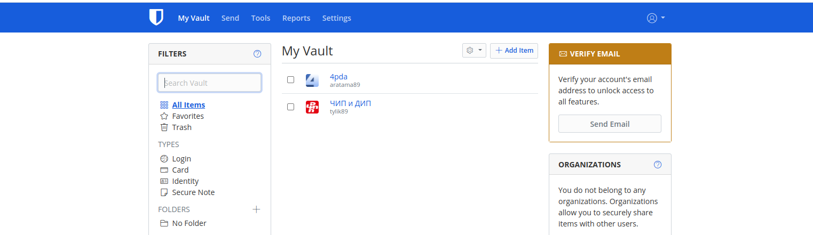
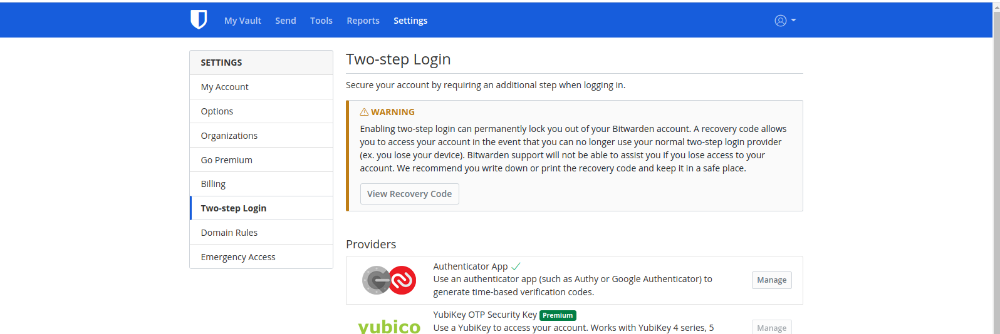
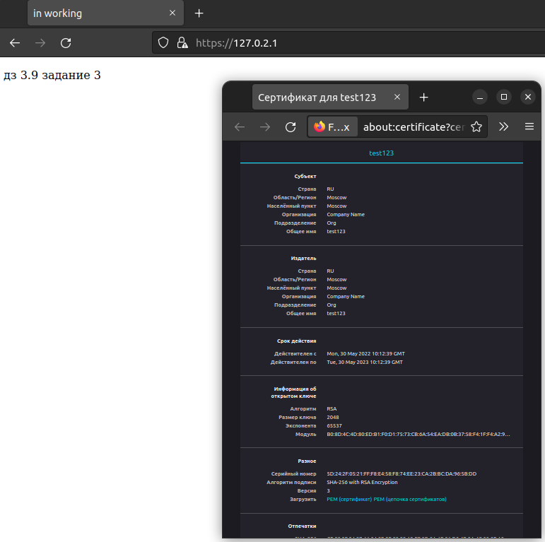
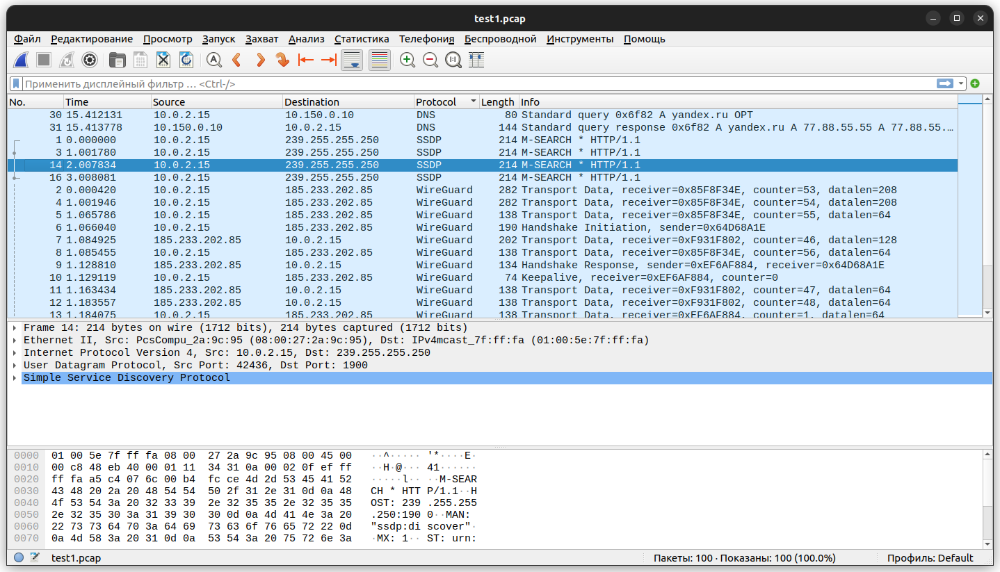

# Домашнее задание к занятию "3.9. Элементы безопасности информационных систем"

1. Установите Bitwarden плагин для браузера. Зарегестрируйтесь и сохраните несколько паролей.



2. Установите Google authenticator на мобильный телефон. Настройте вход в Bitwarden акаунт через Google authenticator OTP.



3. Установите apache2, сгенерируйте самоподписанный сертификат, настройте тестовый сайт для работы по HTTPS.


```shell
sudo apt install apache2
sudo ufw allow "Apache Full"
sudo systemctl restart apache2
sudo a2enmod ssl
sudo systemctl restart apache2
```
Создаем сертификат и закрытый ключ:
```shell
sudo openssl req -x509 -nodes -days 365 \
-newkey rsa:2048 \
-keyout /etc/ssl/private/apache-selfsigned.key \
-out /etc/ssl/certs/apache-selfsigned.crt \
-subj "/C=RU/ST=Moscow/L=Moscow/O=Company Name/OU=Org/CN=test123"
```
Создаем конфиг сайта:
```shell
sudo vim /etc/apache2/sites-available/test123.conf
`
<VirtualHost *:443>
ServerName test123:443
DocumentRoot /var/www/test123
SSLEngine on
SSLCertificateFile /etc/ssl/certs/apache-selfsigned.crt
SSLCertificateKeyFile /etc/ssl/private/apache-selfsigned.key
</VirtualHost>
`
```
Создадим каталог `DocumentRoot` и поместим в него файл HTML для целей тестирования:
```shell

sudo mkdir /var/www/test123
sudo vim /var/www/test123/index.html
`
<!DOCTYPE HTML>
   <html>
   <head>
      <title>in working</title>
      <meta charset="utf-8">
   </head>
   <body>  
      <p>дз 3.9 задание 3  </p>
         </body>
</html>
`
```
активируем файл конфигурации с помощью инструмента a2ensite:
```shell
sudo a2dissite 000-default.conf 
sudo rm /etc/apache2/sites-enabled/default-ssl.conf
sudo a2ensite test123.conf
```
Затем проверим ошибки конфигурации:
```shell
sudo apache2ctl configtest
```


4. Проверьте на TLS уязвимости произвольный сайт в интернете (кроме сайтов МВД, ФСБ, МинОбр, НацБанк, РосКосмос, РосАтом, РосНАНО и любых госкомпаний, объектов КИИ, ВПК ... и тому подобное).

```shell
1@a1:~/testssl.sh$ ./testssl.sh https://ixnfo.com/

###########################################################
    testssl.sh       3.1dev from https://testssl.sh/dev/
    (d931eb4 2022-05-14 13:57:46)

      This program is free software. Distribution and
             modification under GPLv2 permitted.
      USAGE w/o ANY WARRANTY. USE IT AT YOUR OWN RISK!

       Please file bugs @ https://testssl.sh/bugs/

###########################################################

 Using "OpenSSL 1.0.2-chacha (1.0.2k-dev)" [~179 ciphers]
 on a1:./bin/openssl.Linux.x86_64
 (built: "Jan 18 17:12:17 2019", platform: "linux-x86_64")


 Start 2022-05-30 15:01:35        -->> 116.203.185.85:443 (ixnfo.com) <<--

 rDNS (116.203.185.85):  ixnfo.com.
 Service detected:       HTTP


 Testing protocols via sockets except NPN+ALPN 

 SSLv2      not offered (OK)
 SSLv3      not offered (OK)
 TLS 1      not offered
 TLS 1.1    not offered
 TLS 1.2    offered (OK)
 TLS 1.3    not offered and downgraded to a weaker protocol
 NPN/SPDY   h2, http/1.1 (advertised)
 ALPN/HTTP2 h2, http/1.1 (offered)

 Testing cipher categories 

 NULL ciphers (no encryption)                      not offered (OK)
 Anonymous NULL Ciphers (no authentication)        not offered (OK)
 Export ciphers (w/o ADH+NULL)                     not offered (OK)
 LOW: 64 Bit + DES, RC[2,4], MD5 (w/o export)      not offered (OK)
 Triple DES Ciphers / IDEA                         not offered
 Obsoleted CBC ciphers (AES, ARIA etc.)            offered
 Strong encryption (AEAD ciphers) with no FS       offered (OK)
 Forward Secrecy strong encryption (AEAD ciphers)  offered (OK)


 Testing server's cipher preferences 

Hexcode  Cipher Suite Name (OpenSSL)       KeyExch.   Encryption  Bits     Cipher Suite Name (IANA/RFC)
-----------------------------------------------------------------------------------------------------------------------------
SSLv2
 - 
SSLv3
 - 
TLSv1
 - 
TLSv1.1
 - 
TLSv1.2 (server order)
 xc030   ECDHE-RSA-AES256-GCM-SHA384       ECDH 253   AESGCM      256      TLS_ECDHE_RSA_WITH_AES_256_GCM_SHA384              
 xcca8   ECDHE-RSA-CHACHA20-POLY1305       ECDH 253   ChaCha20    256      TLS_ECDHE_RSA_WITH_CHACHA20_POLY1305_SHA256        
 xc061   ECDHE-ARIA256-GCM-SHA384          ECDH 253   ARIAGCM     256      TLS_ECDHE_RSA_WITH_ARIA_256_GCM_SHA384             
 xc02f   ECDHE-RSA-AES128-GCM-SHA256       ECDH 253   AESGCM      128      TLS_ECDHE_RSA_WITH_AES_128_GCM_SHA256              
 xc060   ECDHE-ARIA128-GCM-SHA256          ECDH 253   ARIAGCM     128      TLS_ECDHE_RSA_WITH_ARIA_128_GCM_SHA256             
 xc028   ECDHE-RSA-AES256-SHA384           ECDH 253   AES         256      TLS_ECDHE_RSA_WITH_AES_256_CBC_SHA384              
 xc077   ECDHE-RSA-CAMELLIA256-SHA384      ECDH 253   Camellia    256      TLS_ECDHE_RSA_WITH_CAMELLIA_256_CBC_SHA384         
 xc027   ECDHE-RSA-AES128-SHA256           ECDH 253   AES         128      TLS_ECDHE_RSA_WITH_AES_128_CBC_SHA256              
 xc076   ECDHE-RSA-CAMELLIA128-SHA256      ECDH 253   Camellia    128      TLS_ECDHE_RSA_WITH_CAMELLIA_128_CBC_SHA256         
 xc014   ECDHE-RSA-AES256-SHA              ECDH 253   AES         256      TLS_ECDHE_RSA_WITH_AES_256_CBC_SHA                 
 xc013   ECDHE-RSA-AES128-SHA              ECDH 253   AES         128      TLS_ECDHE_RSA_WITH_AES_128_CBC_SHA                 
 x9d     AES256-GCM-SHA384                 RSA        AESGCM      256      TLS_RSA_WITH_AES_256_GCM_SHA384                    
 xc0a1   AES256-CCM8                       RSA        AESCCM8     256      TLS_RSA_WITH_AES_256_CCM_8                         
 xc09d   AES256-CCM                        RSA        AESCCM      256      TLS_RSA_WITH_AES_256_CCM                           
 xc051   ARIA256-GCM-SHA384                RSA        ARIAGCM     256      TLS_RSA_WITH_ARIA_256_GCM_SHA384                   
 x9c     AES128-GCM-SHA256                 RSA        AESGCM      128      TLS_RSA_WITH_AES_128_GCM_SHA256                    
 xc0a0   AES128-CCM8                       RSA        AESCCM8     128      TLS_RSA_WITH_AES_128_CCM_8                         
 xc09c   AES128-CCM                        RSA        AESCCM      128      TLS_RSA_WITH_AES_128_CCM                           
 xc050   ARIA128-GCM-SHA256                RSA        ARIAGCM     128      TLS_RSA_WITH_ARIA_128_GCM_SHA256                   
 x3d     AES256-SHA256                     RSA        AES         256      TLS_RSA_WITH_AES_256_CBC_SHA256                    
 xc0     CAMELLIA256-SHA256                RSA        Camellia    256      TLS_RSA_WITH_CAMELLIA_256_CBC_SHA256               
 x3c     AES128-SHA256                     RSA        AES         128      TLS_RSA_WITH_AES_128_CBC_SHA256                    
 xba     CAMELLIA128-SHA256                RSA        Camellia    128      TLS_RSA_WITH_CAMELLIA_128_CBC_SHA256               
 x35     AES256-SHA                        RSA        AES         256      TLS_RSA_WITH_AES_256_CBC_SHA                       
 x84     CAMELLIA256-SHA                   RSA        Camellia    256      TLS_RSA_WITH_CAMELLIA_256_CBC_SHA                  
 x2f     AES128-SHA                        RSA        AES         128      TLS_RSA_WITH_AES_128_CBC_SHA                       
 x41     CAMELLIA128-SHA                   RSA        Camellia    128      TLS_RSA_WITH_CAMELLIA_128_CBC_SHA                  
TLSv1.3
 - 

 Has server cipher order?     yes (OK)
 Negotiated protocol          TLSv1.2
 Negotiated cipher            ECDHE-RSA-AES256-GCM-SHA384, 256 bit ECDH (P-256)

 Testing robust forward secrecy (FS) -- omitting Null Authentication/Encryption, 3DES, RC4 

 FS is offered (OK)           ECDHE-RSA-AES256-GCM-SHA384 ECDHE-RSA-AES256-SHA384
                              ECDHE-RSA-AES256-SHA ECDHE-RSA-CHACHA20-POLY1305
                              ECDHE-RSA-CAMELLIA256-SHA384 ECDHE-ARIA256-GCM-SHA384
                              ECDHE-RSA-AES128-GCM-SHA256 ECDHE-RSA-AES128-SHA256
                              ECDHE-RSA-AES128-SHA ECDHE-RSA-CAMELLIA128-SHA256
                              ECDHE-ARIA128-GCM-SHA256 
 Elliptic curves offered:     prime256v1 secp384r1 secp521r1 X25519 X448 


 Testing server defaults (Server Hello) 

 TLS extensions (standard)    "renegotiation info/#65281" "server name/#0" "EC point formats/#11"
                              "session ticket/#35" "status request/#5" "next protocol/#13172"
                              "max fragment length/#1" "application layer protocol negotiation/#16"
                              "encrypt-then-mac/#22" "extended master secret/#23"
 Session Ticket RFC 5077 hint 300 seconds, session tickets keys seems to be rotated < daily
 SSL Session ID support       yes
 Session Resumption           Tickets: yes, ID: no
 TLS clock skew               Random values, no fingerprinting possible 
 Client Authentication        none
 Signature Algorithm          SHA256 with RSA
 Server key size              RSA 2048 bits (exponent is 65537)
 Server key usage             Digital Signature, Key Encipherment
 Server extended key usage    TLS Web Server Authentication, TLS Web Client Authentication
 Serial                       03BC79E43986CFBA3B18F570C3F457AC6BC7 (OK: length 18)
 Fingerprints                 SHA1 9C99FD3CDED67CBF6694E8915CB8987DBF7BFD3F
                              SHA256 F3FCFA8054B3EF58FF35DB158FC1B4088FCA45122A69628CBF60EA7307FBACFC
 Common Name (CN)             ixnfo.com 
 subjectAltName (SAN)         ixnfo.com 
 Trust (hostname)             Ok via SAN and CN (same w/o SNI)
 Chain of trust               Ok   
 EV cert (experimental)       no 
 Certificate Validity (UTC)   50 >= 30 days (2022-04-20 20:39 --> 2022-07-19 20:39)
 ETS/"eTLS", visibility info  not present
 Certificate Revocation List  --
 OCSP URI                     http://r3.o.lencr.org
 OCSP stapling                offered, not revoked
 OCSP must staple extension   --
 DNS CAA RR (experimental)    not offered
 Certificate Transparency     yes (certificate extension)
 Certificates provided        3
 Issuer                       R3 (Let's Encrypt from US)
 Intermediate cert validity   #1: ok > 40 days (2025-09-15 16:00). R3 <-- ISRG Root X1
                              #2: ok > 40 days (2024-09-30 18:14). ISRG Root X1 <-- DST Root CA X3
 Intermediate Bad OCSP (exp.) Ok


 Testing HTTP header response @ "/" 

 HTTP Status Code             200 OK
 HTTP clock skew              +33 sec from localtime
 Strict Transport Security    365 days=31536000 s, just this domain
 Public Key Pinning           --
 Server banner                nginx
 Application banner           --
 Cookie(s)                    1 issued: 1/1 secure, NOT HttpOnly
 Security headers             --
 Reverse Proxy banner         --


 Testing vulnerabilities 

 Heartbleed (CVE-2014-0160)                not vulnerable (OK), no heartbeat extension
 CCS (CVE-2014-0224)                       not vulnerable (OK)
 Ticketbleed (CVE-2016-9244), experiment.  not vulnerable (OK)
 ROBOT                                     not vulnerable (OK)
 Secure Renegotiation (RFC 5746)           supported (OK)
 Secure Client-Initiated Renegotiation     not vulnerable (OK)
 CRIME, TLS (CVE-2012-4929)                not vulnerable (OK)
 BREACH (CVE-2013-3587)                    potentially NOT ok, "gzip" HTTP compression detected. - only supplied "/" tested
                                           Can be ignored for static pages or if no secrets in the page
 POODLE, SSL (CVE-2014-3566)               not vulnerable (OK), no SSLv3 support
 TLS_FALLBACK_SCSV (RFC 7507)              No fallback possible (OK), no protocol below TLS 1.2 offered
 SWEET32 (CVE-2016-2183, CVE-2016-6329)    not vulnerable (OK)
 FREAK (CVE-2015-0204)                     not vulnerable (OK)
 DROWN (CVE-2016-0800, CVE-2016-0703)      not vulnerable on this host and port (OK)
                                           make sure you don't use this certificate elsewhere with SSLv2 enabled services, see
                                           https://search.censys.io/search?resource=hosts&virtual_hosts=INCLUDE&q=F3FCFA8054B3EF58FF35DB158FC1B4088FCA45122A69628CBF60EA7307FBACFC
 LOGJAM (CVE-2015-4000), experimental      not vulnerable (OK): no DH EXPORT ciphers, no DH key detected with <= TLS 1.2
 BEAST (CVE-2011-3389)                     not vulnerable (OK), no SSL3 or TLS1
 LUCKY13 (CVE-2013-0169), experimental     potentially VULNERABLE, uses cipher block chaining (CBC) ciphers with TLS. Check patches
 Winshock (CVE-2014-6321), experimental    not vulnerable (OK) - ARIA, CHACHA or CCM ciphers found
 RC4 (CVE-2013-2566, CVE-2015-2808)        no RC4 ciphers detected (OK)


 Running client simulations (HTTP) via sockets 

 Browser                      Protocol  Cipher Suite Name (OpenSSL)       Forward Secrecy
------------------------------------------------------------------------------------------------
 Android 4.4.2                TLSv1.2   ECDHE-RSA-AES256-GCM-SHA384       256 bit ECDH (P-256)
 Android 5.0.0                TLSv1.2   ECDHE-RSA-AES128-GCM-SHA256       256 bit ECDH (P-256)
 Android 6.0                  TLSv1.2   ECDHE-RSA-AES128-GCM-SHA256       256 bit ECDH (P-256)
 Android 7.0 (native)         TLSv1.2   ECDHE-RSA-AES256-GCM-SHA384       256 bit ECDH (P-256)
 Android 8.1 (native)         TLSv1.2   ECDHE-RSA-AES256-GCM-SHA384       253 bit ECDH (X25519)
 Android 9.0 (native)         TLSv1.2   ECDHE-RSA-AES256-GCM-SHA384       253 bit ECDH (X25519)
 Android 10.0 (native)        TLSv1.2   ECDHE-RSA-AES256-GCM-SHA384       253 bit ECDH (X25519)
 Chrome 74 (Win 10)           TLSv1.2   ECDHE-RSA-AES256-GCM-SHA384       253 bit ECDH (X25519)
 Chrome 79 (Win 10)           TLSv1.2   ECDHE-RSA-AES256-GCM-SHA384       253 bit ECDH (X25519)
 Firefox 66 (Win 8.1/10)      TLSv1.2   ECDHE-RSA-AES256-GCM-SHA384       253 bit ECDH (X25519)
 Firefox 71 (Win 10)          TLSv1.2   ECDHE-RSA-AES256-GCM-SHA384       253 bit ECDH (X25519)
 IE 6 XP                      No connection
 IE 8 Win 7                   No connection
 IE 8 XP                      No connection
 IE 11 Win 7                  TLSv1.2   ECDHE-RSA-AES256-SHA384           256 bit ECDH (P-256)
 IE 11 Win 8.1                TLSv1.2   ECDHE-RSA-AES256-SHA384           256 bit ECDH (P-256)
 IE 11 Win Phone 8.1          TLSv1.2   ECDHE-RSA-AES128-SHA256           256 bit ECDH (P-256)
 IE 11 Win 10                 TLSv1.2   ECDHE-RSA-AES256-GCM-SHA384       256 bit ECDH (P-256)
 Edge 15 Win 10               TLSv1.2   ECDHE-RSA-AES256-GCM-SHA384       253 bit ECDH (X25519)
 Edge 17 (Win 10)             TLSv1.2   ECDHE-RSA-AES256-GCM-SHA384       253 bit ECDH (X25519)
 Opera 66 (Win 10)            TLSv1.2   ECDHE-RSA-AES256-GCM-SHA384       253 bit ECDH (X25519)
 Safari 9 iOS 9               TLSv1.2   ECDHE-RSA-AES256-GCM-SHA384       256 bit ECDH (P-256)
 Safari 9 OS X 10.11          TLSv1.2   ECDHE-RSA-AES256-GCM-SHA384       256 bit ECDH (P-256)
 Safari 10 OS X 10.12         TLSv1.2   ECDHE-RSA-AES256-GCM-SHA384       256 bit ECDH (P-256)
 Safari 12.1 (iOS 12.2)       TLSv1.2   ECDHE-RSA-AES256-GCM-SHA384       253 bit ECDH (X25519)
 Safari 13.0 (macOS 10.14.6)  TLSv1.2   ECDHE-RSA-AES256-GCM-SHA384       253 bit ECDH (X25519)
 Apple ATS 9 iOS 9            TLSv1.2   ECDHE-RSA-AES256-GCM-SHA384       256 bit ECDH (P-256)
 Java 6u45                    No connection
 Java 7u25                    No connection
 Java 8u161                   TLSv1.2   ECDHE-RSA-AES256-GCM-SHA384       256 bit ECDH (P-256)
 Java 11.0.2 (OpenJDK)        TLSv1.2   ECDHE-RSA-AES256-GCM-SHA384       256 bit ECDH (P-256)
 Java 12.0.1 (OpenJDK)        TLSv1.2   ECDHE-RSA-AES256-GCM-SHA384       256 bit ECDH (P-256)
 OpenSSL 1.0.2e               TLSv1.2   ECDHE-RSA-AES256-GCM-SHA384       256 bit ECDH (P-256)
 OpenSSL 1.1.0l (Debian)      TLSv1.2   ECDHE-RSA-AES256-GCM-SHA384       253 bit ECDH (X25519)
 OpenSSL 1.1.1d (Debian)      TLSv1.2   ECDHE-RSA-AES256-GCM-SHA384       253 bit ECDH (X25519)
 Thunderbird (68.3)           TLSv1.2   ECDHE-RSA-AES256-GCM-SHA384       253 bit ECDH (X25519)


 Rating (experimental) 

 Rating specs (not complete)  SSL Labs's 'SSL Server Rating Guide' (version 2009q from 2020-01-30)
 Specification documentation  https://github.com/ssllabs/research/wiki/SSL-Server-Rating-Guide
 Protocol Support (weighted)  100 (30)
 Key Exchange     (weighted)  90 (27)
 Cipher Strength  (weighted)  90 (36)
 Final Score                  93
 Overall Grade                A+

 Done 2022-05-30 15:03:14 [ 101s] -->> 116.203.185.85:443 (ixnfo.com) <<--
```

5. Установите на Ubuntu ssh сервер, сгенерируйте новый приватный ключ. Скопируйте свой публичный ключ на другой сервер. Подключитесь к серверу по SSH-ключу.
```shell
vagrant@vagrant:~$ sudo apt install openssh-server
Reading package lists... Done
Building dependency tree       
Reading state information... Done
openssh-server is already the newest version (1:8.2p1-4ubuntu0.3).
0 upgraded, 0 newly installed, 0 to remove and 0 not upgraded.
vagrant@vagrant:~$ ssh-keygen
Generating public/private rsa key pair.
Enter file in which to save the key (/home/vagrant/.ssh/id_rsa): 
Enter passphrase (empty for no passphrase): 
Enter same passphrase again: 
Your identification has been saved in /home/vagrant/.ssh/id_rsa
Your public key has been saved in /home/vagrant/.ssh/id_rsa.pub
The key fingerprint is:
SHA256:mOuc9UqPK+CVFSWuapKeCMKpHOVjacftJwr6r6AaNKs vagrant@vagrant
The key's randomart image is:
+---[RSA 3072]----+
|        ...      |
|       ...       |
|        ..       |
|       +.        |
| o .  +oS        |
|o *.+.+.         |
|+*oOo=..o        |
|B+*+=oo= =       |
|Eo+ooo=o*oo      |
+----[SHA256]-----+

vagrant@vagrant:~$ ssh-copy-id a1@10.2.2.2
/usr/bin/ssh-copy-id: INFO: Source of key(s) to be installed: "/home/vagrant/.ssh/id_rsa.pub"
/usr/bin/ssh-copy-id: INFO: attempting to log in with the new key(s), to filter out any that are already installed
/usr/bin/ssh-copy-id: INFO: 1 key(s) remain to be installed -- if you are prompted now it is to install the new keys
a1@10.2.2.2's password: 

Number of key(s) added: 1

Now try logging into the machine, with:   "ssh 'a1@10.2.2.2'"
and check to make sure that only the key(s) you wanted were added.

vagrant@vagrant:~$ ssh  a1@10.2.2.2
Welcome to Ubuntu 22.04 LTS (GNU/Linux 5.15.0-33-generic x86_64)

 * Documentation:  https://help.ubuntu.com
 * Management:     https://landscape.canonical.com
 * Support:        https://ubuntu.com/advantage

5 обновлений может быть применено немедленно.
Чтобы просмотреть дополнительные обновления выполните: apt list --upgradable

Last login: Tue May 31 07:23:22 2022 from 10.2.2.2
a1@a1:~$ 
```


6. Переименуйте файлы ключей из задания 5. Настройте файл конфигурации SSH клиента, так чтобы вход на удаленный сервер осуществлялся по имени сервера.

```shell
vagrant@vagrant:~$ mv /home/vagrant/.ssh/id_rsa rsa && mv /home/vagrant/.ssh/id_rsa.pub rsa.pub
vagrant@vagrant:~$ sudo vim .ssh/config
vagrant@vagrant:~$ ssh host_a1
Welcome to Ubuntu 22.04 LTS (GNU/Linux 5.15.0-33-generic x86_64)

 * Documentation:  https://help.ubuntu.com
 * Management:     https://landscape.canonical.com
 * Support:        https://ubuntu.com/advantage

5 обновлений может быть применено немедленно.
Чтобы просмотреть дополнительные обновления выполните: apt list --upgradable

Last login: Tue May 31 07:30:07 2022 from 10.2.2.2
a1@a1:~$ 

```
ssh_config:
```shell
Host host_a1
  HostName 10.2.2.2 
  Port 22 
  User a1 
  IdentityFile  /home/vagrant/rsa
```

7. Соберите дамп трафика утилитой tcpdump в формате pcap, 100 пакетов. Откройте файл pcap в Wireshark.

```shell
a1@a1:~$ sudo tcpdump -w test1.pcap -i enp0s3 -c 100
tcpdump: listening on enp0s3, link-type EN10MB (Ethernet), snapshot length 262144 bytes
100 packets captured
365 packets received by filter
0 packets dropped by kernel

```

----